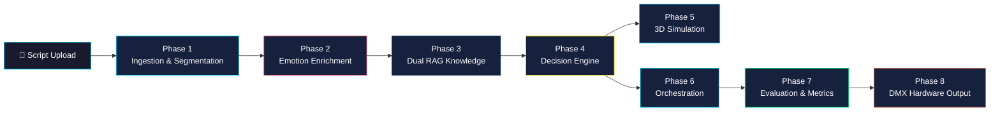

<div align="center">

  

  <br />

  # ✨ LUMINA INTELLIGENCE

  ### Automated Auditorium Lighting System

  <p>
    <em>An enterprise-grade, AI-driven pipeline that ingests theatrical scripts & event schedules,<br />
    performs deep emotional analysis, and automatically orchestrates DMX-ready stage lighting cues.</em>
  </p>

  <br />

  <!-- Technology Badges -->
  [](#)
  [](#)
  [](#)
  [](#)
  [](#)

  [](#)
  [](#)
  [](#)
  [](#)
  [](#)

  [](#)
  [](#)
  [](#)
  [](#)

  <br />

  [](LICENSE)
  [](#)
  [](#-architecture--pipeline)

  <br />

  [🚀 Live Demo](#-deployment) · [📖 Documentation](#-documentation) · [⚡ Quick Start](#-quick-start) · [🏗️ Architecture](#-architecture--pipeline)

</div>

<br />

---

<br />

## 🌟 Overview

**Lumina Intelligence** bridges the gap between human storytelling and technical stage production. By ingesting raw theatrical scripts or event schedules, the system leverages advanced **Natural Language Processing (NLP)** to segment scenes, analyze emotional sentiment, cross-reference professional stage lighting principles via **Retrieval-Augmented Generation (RAG)**, and dynamically generate highly accurate lighting cues — complete with DMX values, fixture assignments, color palettes, and transitions — that perfectly match the mood of any performance.

### 🎯 Key Capabilities

| Feature | Description |
|:--------|:------------|
| 🧠 **AI Emotion Analysis** | DistilRoBERTa ML model detects joy, fear, anger, sadness, surprise, disgust & neutral from any script |
| 💡 **Smart Lighting Design** | RAG + LangChain knowledge base generates professional lighting cues automatically |
| 🎬 **3D Visualization** | Real-time Three.js WebGL simulation with 40+ fixtures, smoke effects, and smooth transitions |
| 📊 **8-Check Evaluation** | Schema, hardware limits, conflict resolution, stability, drift, confidence, narrative & coherence checks |
| 🔄 **Dual Pipeline Modes** | Multi-stage (phase-by-phase) or single-pass (full-context LLM) processing |
| 📝 **Multi-Format Ingestion** | Supports `.pdf`, `.txt`, and `.docx` script uploads |
| 🎛️ **DMX/OSC Hardware Bridge** | Phase 8 adapter for LightKey, MIDI, and physical lighting fixtures |
| 🔁 **Human Feedback Loop** | RLHF-ready feedback collection for continuous improvement |

<br />

---

<br />

## 🏗️ Architecture & Pipeline

The system is structured into a rigorous **8-phase pipeline**, orchestrated by a concurrent FastAPI backend and presented via a sleek React frontend.



### Phase Details

| Phase | Component | Description | Key Technologies |
|:------|:----------|:------------|:-----------------|
| **Phase 1** | 📥 Ingestion & Segmentation | Parses `.pdf`, `.docx`, `.txt`. Uses LLMs to segment text into JSON scenes with timestamps | `PyPDF2`, `python-docx`, `Mistral AI` |
| **Phase 2** | 🧠 Emotion Enrichment | Analyzes dialogue to detect core emotions, valence, arousal. Includes Graph RAG & multi-head analysis | `DistilRoBERTa`, `PyTorch`, `NetworkX` |
| **Phase 3** | 📚 Dual RAG Knowledge | Retrieves rules from lighting handbooks & maps narrative states to lighting paradigms | `FAISS`, `SentenceTransformers`, `LangChain` |
| **Phase 4** | 💡 Decision Engine | Synthesizes emotional data + RAG rules into concrete lighting instructions (Color, Intensity, Transitions) | Custom Heuristics, `GPT-4` |
| **Phase 5** | 🎬 3D Simulation | Real-time WebGL visualization with 40+ fixtures, smoke, and transitions | `Three.js`, `WebSocket` |
| **Phase 6** | ⚙️ Orchestration | Pipeline state tracking, batch execution, error handling & recovery | `Pydantic`, Custom State Machine |
| **Phase 7** | 📊 Evaluation & Metrics | 8-check evaluation system with coherence, conflict, structural & transition analysis | Custom Evaluation Suite |
| **Phase 8** | 🎛️ Hardware Bridge | DMX adapter, LightKey control, MIDI & OSC integration for physical fixtures | `python-osc`, MIDI |

<br />

---

<br />

## 🛠️ Technology Stack

<table>
  <tr>
    <td align="center" width="50%">
      <h3>🖥️ Frontend</h3>
      <p>
        
        
        
        
      </p>
      <ul align="left">
        <li><strong>Framework:</strong> React 19 + Vite 7</li>
        <li><strong>Styling:</strong> TailwindCSS + Custom Animations</li>
        <li><strong>3D Engine:</strong> Three.js (WebGL)</li>
        <li><strong>Icons:</strong> Lucide React</li>
        <li><strong>Routing:</strong> React Router v7</li>
        <li><strong>Real-time:</strong> WebSocket</li>
        <li><strong>Hosting:</strong> Vercel</li>
      </ul>
    </td>
    <td align="center" width="50%">
      <h3>⚙️ Backend</h3>
      <p>
        
        
        
        
      </p>
      <ul align="left">
        <li><strong>API:</strong> FastAPI + Uvicorn</li>
        <li><strong>AI/ML:</strong> PyTorch, HuggingFace Transformers</li>
        <li><strong>NLP Model:</strong> DistilRoBERTa</li>
        <li><strong>Vector DB:</strong> FAISS (Similarity Search)</li>
        <li><strong>LLM:</strong> OpenAI GPT-4, Mistral AI</li>
        <li><strong>Validation:</strong> Pydantic v2</li>
        <li><strong>Hosting:</strong> AWS EC2 (Ubuntu)</li>
      </ul>
    </td>
  </tr>
</table>

<br />

---

<br />

## ⚡ Quick Start

### Prerequisites

- **Python** 3.11+
- **Node.js** 18+ & npm
- **Git**

### 1️⃣ Clone the Repository

```bash
git clone https://github.com/ram-49-kaps/Automated_Auditorium_Lighting_FINL.git
cd Automated_Auditorium_Lighting_FINL
```

### 2️⃣ Backend Setup

```bash
# Create and activate a virtual environment
python -m venv venv
source venv/bin/activate   # On Windows: venv\Scripts\activate

# Install dependencies
pip install -r requirements.txt

# Create .env file with your API keys
cp .env.example .env
# Add: OPENAI_API_KEY=your_key_here

# Start the FastAPI server (runs on port 8000)
uvicorn backend.app:app --host 0.0.0.0 --port 8000 --reload
```

### 3️⃣ Frontend Setup

```bash
# Open a new terminal
cd frontend

# Install dependencies
npm install

# Start the Vite dev server (runs on port 5173)
npm run dev
```

### 4️⃣ One-Command Launch (Both Services)

```bash
python launch.py
```

> 🌐 **Frontend:** http://localhost:5173 &nbsp;&nbsp;|&nbsp;&nbsp; 🔌 **Backend API:** http://localhost:8000 &nbsp;&nbsp;|&nbsp;&nbsp; 📖 **API Docs:** http://localhost:8000/docs

<br />

---

<br />

## 💡 Usage

<table>
  <tr>
    <td width="60">
      <h3>1</h3>
    </td>
    <td>
      <strong>Upload Script</strong> — Drag & drop your <code>.pdf</code>, <code>.txt</code>, or <code>.docx</code> file via the sleek upload interface
    </td>
  </tr>
  <tr>
    <td>
      <h3>2</h3>
    </td>
    <td>
      <strong>AI Processing</strong> — Watch the real-time pipeline extract scenes, analyze emotions, and apply RAG knowledge
    </td>
  </tr>
  <tr>
    <td>
      <h3>3</h3>
    </td>
    <td>
      <strong>View Results</strong> — Explore generated lighting cues with the 8-check evaluation dashboard
    </td>
  </tr>
  <tr>
    <td>
      <h3>4</h3>
    </td>
    <td>
      <strong>3D Simulation</strong> — Launch the real-time Three.js visualization to see lights on a virtual stage
    </td>
  </tr>
  <tr>
    <td>
      <h3>5</h3>
    </td>
    <td>
      <strong>Download / Export</strong> — Get the JSON lighting instructions for DMX hardware integration
    </td>
  </tr>
</table>

<br />

---

<br />

## 📊 Evaluation System (Phase 7)

The system runs an **8-check evaluation** on every generated scene:

| Check Code | Check Name | What It Validates |
|:----------:|:-----------|:------------------|
| `SCH` | Schema Integrity | Output matches the required JSON structural schema |
| `HRD` | Hardware Limits | No fixture group exceeds 100% intensity capacity |
| `CFT` | Conflict Resolution | Detects overlapping/contradictory fixture instructions |
| `STB` | Sequence Stability | Prevents aggressively fast transitions (epilepsy safety) |
| `DRF` | Value Drift | Monitors drastic intensity swings between scenes |
| `CNF` | Pipeline Confidence | Neural network prediction score exceeds minimum threshold |
| `NAR` | Narrative Coherence | Emotional intent matches physical lighting manifestation |
| `COH` | Frame Coherence | Fixture palette produces a coherent optical frame |

Each scene receives a verdict: **✅ PASS**, **⚠️ WARN**, or **❌ FAIL** — with AI-generated resolution recommendations.

<br />

---

<br />

## 🚀 Deployment

| Service | Platform | URL |
|:--------|:---------|:----|
| **Backend API** | AWS EC2 (Ubuntu) | `http://16.171.153.178:8000` |
| **Frontend** | Vercel | Auto-deployed on `git push` to `main` |
| **API Docs** | Swagger UI | `http://16.171.153.178:8000/docs` |

<br />

---

<br />

## 📁 Project Structure

```
Automated_Auditorium_Lighting_FINL/
│
├── 🔌 backend/                  # FastAPI server, pipeline runner, WebSocket manager
│   ├── app.py                   # Main API endpoints (upload, results, metrics, simulation)
│   ├── pipeline_runner.py       # Multi-stage & single-pass pipeline execution
│   ├── nlp_lighting_parser.py   # Natural language → structured lighting parameters
│   └── websocket_manager.py     # Real-time progress broadcasting
│
├── 🖥️ frontend/                 # React 19 + Vite 7 SPA
│   ├── src/pages/               # LandingPage, UploadPage, ProcessingPage, ResultsPage
│   ├── src/components/          # Charts, Layout, UI components
│   ├── src/hooks/               # useWebSocket hook for real-time updates
│   └── src/utils/               # API client (centralized backend communication)
│
├── 📥 phase_1/                  # Script Ingestion & Scene Segmentation
├── 🧠 phase_2/                  # Emotion Analysis (DistilRoBERTa + Graph RAG)
├── 📚 phase_3/                  # Dual FAISS RAG (Fixtures + Semantics)
├── 💡 phase_4/                  # Lighting Decision Engine
├── 🎬 phase_5/                  # 3D Simulation & Visualization
├── ⚙️ phase_6/                  # Pipeline Orchestration & State Tracking
├── 📊 phase_7/                  # Evaluation, Metrics & RLHF Feedback
├── 🎛️ phase_8/                  # DMX/LightKey/MIDI/OSC Hardware Bridge
│
├── 📄 contracts/                # JSON schema definitions (locked)
├── 🧪 evaluation/               # Benchmark suite & quick eval
├── 🎪 event_processing/         # College event schedule detection & lighting
├── 🔬 experimental_full_context_pipeline/  # Single-pass full-context LLM pipeline
├── 🎭 external_simulation_prototype/       # Three.js 3D auditorium simulation
├── 📦 data/                     # Scripts, outputs, traces, feedback
├── 📖 docs/                     # Architecture docs, flowcharts, phase guides
├── 📘 Knowledge Books/          # Reference theatrical scripts (PDFs)
├── 📈 Evaluation_and_accuracy/  # Accuracy analysis & ground truth data
├── 📝 project_report_content/   # Academic project report
│
├── ⚙️ config.py                 # Global configuration (models, thresholds, paths)
├── 🚀 launch.py                 # One-command launcher (backend + frontend)
├── 🔧 main.py                   # Main pipeline orchestrator
├── 📋 requirements.txt          # Python dependencies
└── 📜 rules.md                  # Project conventions & guidelines
```

<br />

---

<br />

## 🔑 API Endpoints

| Method | Endpoint | Description |
|:------:|:---------|:------------|
| `GET` | `/health` | Health check |
| `POST` | `/api/validate` | Pre-upload script validation |
| `POST` | `/api/upload` | Upload script & start pipeline |
| `GET` | `/api/results/{job_id}` | Get lighting results |
| `GET` | `/api/metrics/{job_id}` | Get Phase 7 evaluation metrics |
| `GET` | `/api/download/{job_id}` | Download lighting JSON |
| `POST` | `/api/launch/{job_id}` | Launch 3D simulation |
| `POST` | `/api/reprocess/{job_id}` | Re-run pipeline on existing script |
| `POST` | `/api/apply-resolution/{job_id}` | Apply AI-suggested fix |
| `POST` | `/api/manual-edit/{job_id}` | Manual scene override |
| `POST` | `/api/feedback/{job_id}` | Submit RLHF feedback |
| `POST` | `/api/parse-lighting-command` | NLP → structured lighting params |
| `WS` | `/ws/progress/{job_id}` | Real-time progress WebSocket |

<br />

---

<br />

## 📖 Documentation

Detailed documentation is available in the `docs/` directory:

- [`ARCHITECTURE_FLOWCHARTS.md`](docs/ARCHITECTURE_FLOWCHARTS.md) — Visual pipeline flowcharts
- [`DIRECTORY_STRUCTURE.md`](docs/DIRECTORY_STRUCTURE.md) — Complete file tree
- [`PROJECT_WORKFLOW.md`](docs/PROJECT_WORKFLOW.md) — Development workflow guide
- [`SYSTEM_INTERFACES.md`](docs/SYSTEM_INTERFACES.md) — Inter-phase communication contracts

### Phase-Specific Guides
- [`Phase 1 — Script Ingestion`](docs/PHASE_1_ARCHITECTURE.md)
- [`Phase 2 — Emotion Enrichment`](docs/PHASE_2_STRUCTURE.md)
- [`Phase 3 — Dual RAG`](docs/PHASE_3_README.md)
- [`Phase 4 — Decision Engine`](docs/PHASE_4_STRUCTURE.md)
- [`Phase 6 — Orchestration`](docs/PHASE_6_STRUCTURE.md)
- [`Phase 7 — Complete Reference`](phase_7/Phase_7_Complete_Reference.md)

<br />

---

<br />

## 🔬 Research Positioning

This system implements a **dual-mode** architecture for academic research:

1. **🔧 Deterministic Baseline** (Rule-Based) — Provides reproducible, predictable lighting decisions from hand-coded rules mapped to emotions and fixture semantics.

2. **🤖 GenAI Augmentation** (LLM-Enhanced) — Uses GPT-4 via LangChain for creative, context-aware lighting decisions with structured Pydantic output.

3. **📊 Comparative Evaluation** (Phase 7) — Metrics engine enables quantitative comparison between baseline and GenAI modes across determinism, drift, coverage, diversity, and stability.

This architecture supports verifiable research claims about AI-generated lighting quality by providing a measurable baseline for comparison.

<br />

---

<br />

## 🤝 Contributing

Contributions are welcome! Please:

1. Fork the repository
2. Create a feature branch (`git checkout -b feature/amazing-feature`)
3. Commit your changes (`git commit -m 'feat: add amazing feature'`)
4. Push to the branch (`git push origin feature/amazing-feature`)
5. Open a Pull Request

> Ensure new AI models or dependencies are documented in `requirements.txt`.

<br />

---

<br />

## 📄 License

This project is licensed under the **MIT License** — see the [LICENSE](LICENSE) file for details.

<br />

---

<div align="center">

  

  <br />

  <p>
    <strong>Lumina Intelligence</strong> — Where AI Meets Stage Lighting
  </p>

  <sub>Built with ❤️ using PyTorch • FAISS • FastAPI • React • Three.js</sub>

  <br />
  <br />

  [](https://github.com/ram-49-kaps/Automated_Auditorium_Lighting_FINL)

</div>