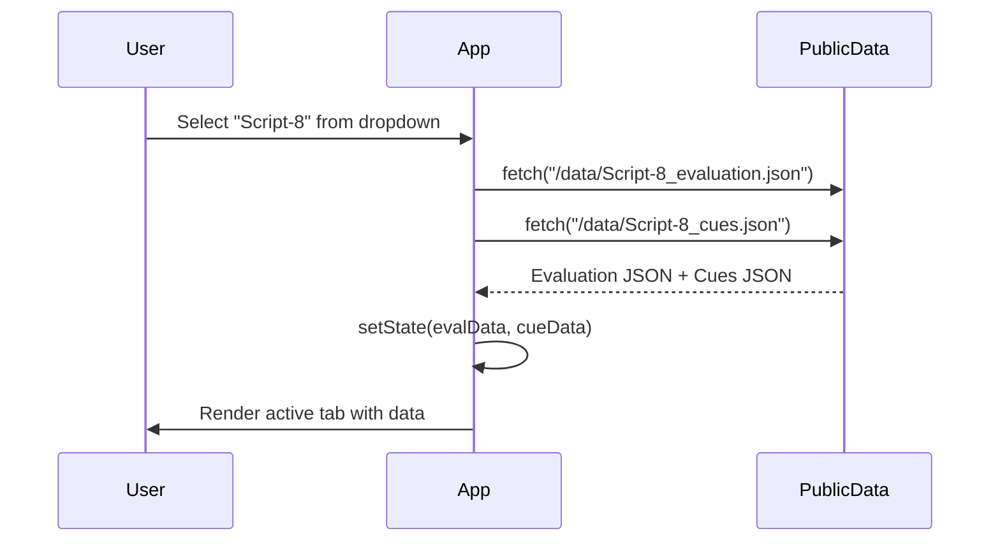
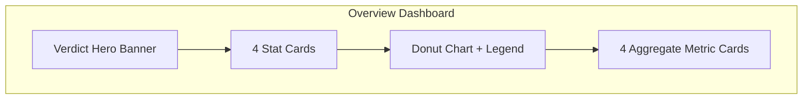
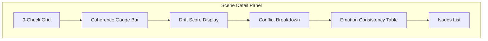
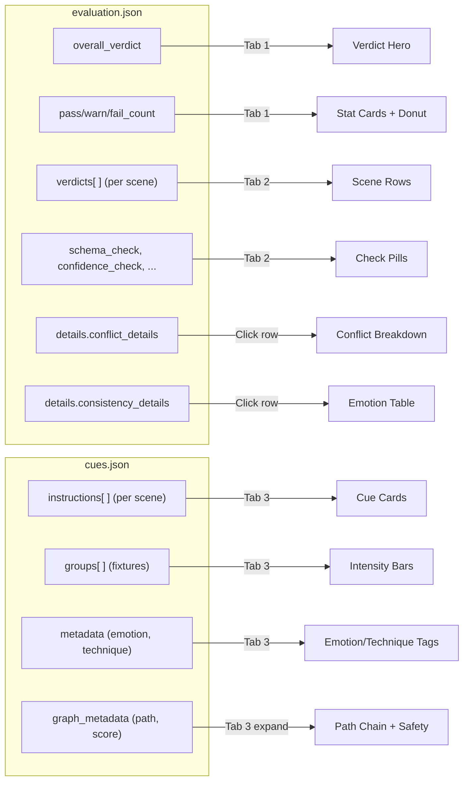

# Phase 7 Frontend — Complete Walkthrough

## How to Run

```bash
cd Phase-7-frontend
npm install      # one-time
npm run dev      # starts at http://localhost:5173
```

---

## Architecture Overview

```mermaid
graph LR
    subgraph "public/data/"
        E["Script-X_evaluation.json"]
        C["Script-X_cues.json"]
    end

    subgraph "React App"
        A["App.jsx"] -->|props| OV["OverviewDashboard"]
        A -->|props| ST["SceneTimeline"]
        A -->|props| LC["LightingCueViewer"]
        ST -->|click scene| SD["SceneDetail"]
    end

    E -->|fetch()| A
    C -->|fetch()| A
```

> **No backend needed.** The app fetches JSON files from `public/data/` at runtime. These are copies of files from `phase_7_testing_output/`.

---

## Data Flow



---

## File Structure

```
Phase-7-frontend/
├── index.html                 ← HTML shell (loads Inter font)
├── package.json               ← Dependencies (React 19 + Vite 6)
├── vite.config.js             ← Dev server config (port 5173)
├── public/
│   └── data/                  ← Copied JSON data (NOT originals)
│       ├── Script-1_evaluation.json
│       ├── Script-1_cues.json
│       ├── Script-5_evaluation.json
│       ├── Script-5_cues.json
│       ├── Script-8_evaluation.json
│       └── Script-8_cues.json
└── src/
    ├── main.jsx               ← React entry point
    ├── App.jsx                ← Root: sidebar + tabs + data loading
    ├── index.css              ← Full dark-theme design system
    └── components/
        ├── OverviewDashboard.jsx  ← Tab 1: summary cards + donut
        ├── SceneTimeline.jsx      ← Tab 2: scene list with check pills
        ├── SceneDetail.jsx        ← Expanded detail for one scene
        └── LightingCueViewer.jsx  ← Tab 3: fixture groups + graph path
```

---

## Component-by-Component Breakdown

### 1. App.jsx — The Root Controller

**What it does:** Orchestrates everything — sidebar, tab navigation, script selection, and data fetching.

| Element | What it shows |
|---------|---------------|
| **Sidebar brand** | "🎭 Phase 7 — Evaluation Dashboard" header |
| **Nav items** | Three clickable tabs: Overview, Scene Timeline, Lighting Cues |
| **Script selector** | Dropdown at sidebar bottom: Script-1, Script-5, Script-8 |
| **Page header** | Current tab name + which script is active + scene count + date |

**How script switching works:**
1. User picks a script from the dropdown (e.g. "Script 5")
2. `useEffect` fires → fetches both `Script-5_evaluation.json` + `Script-5_cues.json`
3. State updates → active tab re-renders with new data

---

### 2. OverviewDashboard.jsx — Tab 1: "📊 Overview"

> **First thing you see.** A bird's-eye summary of the entire evaluation run.



| Section | What it shows | Data source |
|---------|--------------|-------------|
| **Verdict Hero** | Big badge: PASS ✅ / WARN ⚠️ / FAIL ❌ with glow background | `overall_verdict` |
| **"Can Proceed"** | Green pill "Pipeline Can Proceed" or red "Pipeline Blocked" | `can_proceed` boolean |
| **Total Scenes card** | Number of scenes (e.g. "16") | `total_scenes` |
| **Passed card** | Green number + percentage | `pass_count` |
| **Warnings card** | Amber number + percentage | `warn_count` |
| **Failed card** | Red number + percentage | `fail_count` |
| **Donut chart** | Visual ring — green/amber/red arcs proportional to counts | Computed from counts |
| **Avg Coherence** | Number 0.00–1.00 with gauge bar (green ≥0.8, amber ≥0.5, red <0.5) | Average of all `coherence_score` |
| **Avg Drift** | Number (lower = better, 0 = no drift) | Average of all `drift_score` |
| **Total Conflicts** | Sum of all conflicts across scenes | Sum of `total_conflicts` |
| **Report Time** | Human-readable timestamp | `timestamp` field |

---

### 3. SceneTimeline.jsx — Tab 2: "🎬 Scene Timeline"

> **Per-scene health at a glance.** Each scene is a clickable row with colored check pills.

| Element | What it shows |
|---------|---------------|
| **Legend bar** | Maps 3-letter codes to check names: SCH=schema, CNF=confidence, etc. |
| **Scene rows** | One row per scene, showing scene_id on the left |
| **Check pills** | 8 small colored squares per scene, one per check |
| **Alignment tag** | "stable" / "improving" / "declining" trend badge |
| **Verdict badge** | PASS/WARN/FAIL pill on the right |

**The 8 check pills (left to right):**

| Code | Full Name | What it checks |
|------|-----------|---------------|
| **SCH** | Schema Check | Does the lighting instruction have valid structure? |
| **CNF** | Confidence Check | Is the decision confidence above threshold? |
| **CNS** | Consistency Check | Are similar emotions getting similar lighting? |
| **DRF** | Drift Status | Is the system drifting from expected behavior over time? |
| **CFT** | Conflict Check | Any color/intensity/movement/preset conflicts? |
| **STB** | Stability Check | Is output consistent across multiple runs? |
| **NAR** | Narrative Validation | Are emotion transitions logical (not too many flips)? |
| **COH** | Coherence | Aggregate coherence score (≥0.8=green, ≥0.5=amber, <0.5=red) |

**Interaction:** Click any row → opens the **SceneDetail** panel below with a slide-in animation.

---

### 4. SceneDetail.jsx — Expanded Scene Deep-Dive

> **Opens when you click a scene row.** Shows everything about one scene's evaluation.



| Section | What it shows | Color rules |
|---------|--------------|-------------|
| **9-check grid** | 3×3 grid of cards, each showing one check name + PASS/WARN/FAIL | Green/amber/red text |
| **Coherence gauge** | Horizontal bar 0–100% with score | Green ≥80%, amber ≥50%, red <50% |
| **Drift score** | Big number with qualitative label | ≤0.3 "Low—stable" (green), ≤0.6 "Moderate" (amber), >0.6 "High—unstable" (red) |
| **Conflict breakdown** | 4 sub-cards: color, intensity, movement, preset compliance | Each with PASS/WARN + issue count |
| **Emotion table** | Table with columns: Emotion, Variance, Mean Intensity, Count | Shows per-emotion consistency stats |
| **Issues list** | All issues aggregated (schema, hierarchy, confidence, drift, conflict, narrative) | Amber left-border for warnings |

> **Example issue you might see:** *"Primary emotion flips 8 times across 18 scenes (max recommended: 3). Sequence: neutral → fear → neutral → ..."*

---

### 5. LightingCueViewer.jsx — Tab 3: "💡 Lighting Cues"

> **Shows the actual lighting instructions** that Phase 7 evaluated. This is what the lighting system should execute.

Each scene gets a card with:

| Section | What it shows |
|---------|---------------|
| **Header** | Scene ID + 3 tags: emotion (purple), technique (blue), generation method (teal) |
| **Time window** | "🕐 0:00 → 1:30 (90s)" — when this cue plays in the performance |
| **Strategy summary** | Italic text, e.g. *"Graph RAG lighting design for fear using dim_isolation."* |
| **Fixture groups** | Card per group (FRONT_WASH, BACK_LIGHT, SIDE_FILL) showing: |
| → Intensity bar | Purple gradient bar 0–100% with percentage label |
| → Color chip | e.g. "🎨 warm white", "🎨 steel blue" |
| → Focus area | e.g. "🎯 FULL STAGE" |
| → Transition | e.g. "⏱ fade (2.0s)", "⏱ cut (0.3s)" |
| **"Show Graph RAG Details"** | Expandable button revealing the graph reasoning below |

**Expanded Graph RAG Details show:**

| Element | What it shows |
|---------|---------------|
| **Path chain** | Purple node pills connected by arrows: `emotion fear → style low key dramatic → tech dim isolation` |
| **Path score** | e.g. "0.9" — how confident the graph traversal was |
| **Alternatives count** | How many other paths were considered |
| **Fallback used** | Green "No" / amber "Yes" |
| **Safety badges** | Green pills for each safety rule: `✓ SR002_min_intensity`, `✓ SR003_max_intensity`, etc. |
| **Fixture types** | Required hardware: "Fresnel", "PAR RGB", "Profile Spot" |
| **Provenance** | Full reasoning chain: `Graph RAG: emotion_fear → style_low_key_dramatic → tech_dim_isolation` |

---

## Visual Design

| Aspect | Implementation |
|--------|---------------|
| **Theme** | Dark navy/charcoal base (`#0b0e17`) |
| **Cards** | Glassmorphism: semi-transparent + backdrop blur + thin borders |
| **Typography** | Inter from Google Fonts, 8 weights (300–800) |
| **Verdict colors** | Green `#22c55e` (PASS), Amber `#f59e0b` (WARN), Red `#ef4444` (FAIL) |
| **Accent** | Purple `#8b5cf6` for active nav, graph nodes, intensity bars |
| **Animations** | Hover scale on check pills, slide-in on detail panel, smooth gauge transitions |
| **Scrollbar** | Custom thin dark scrollbar matching the theme |

---

## How Data Maps to UI


