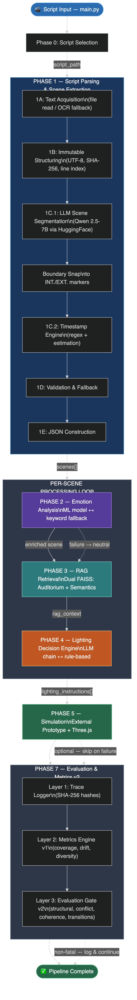
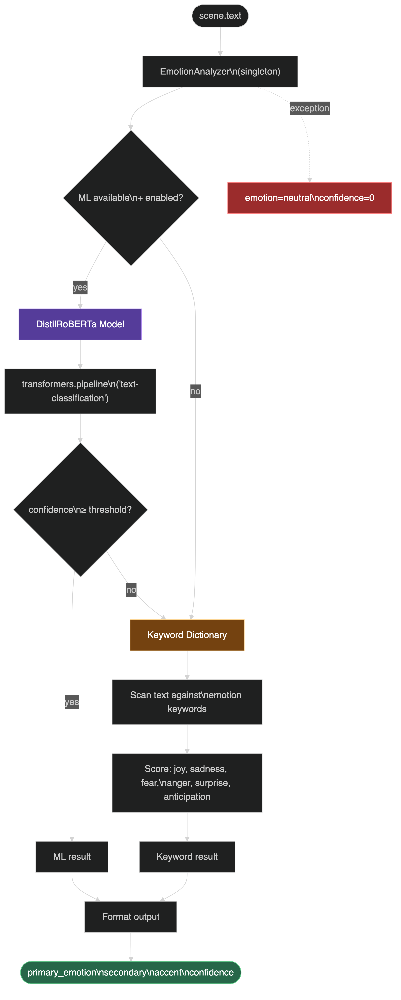
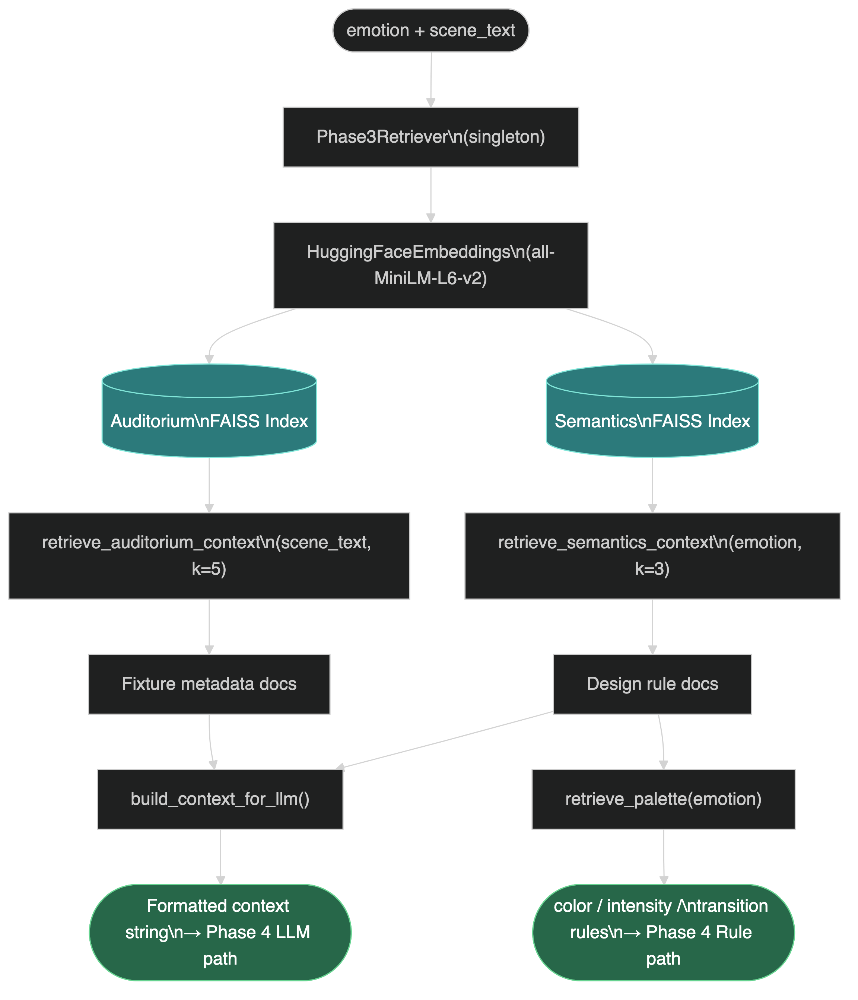
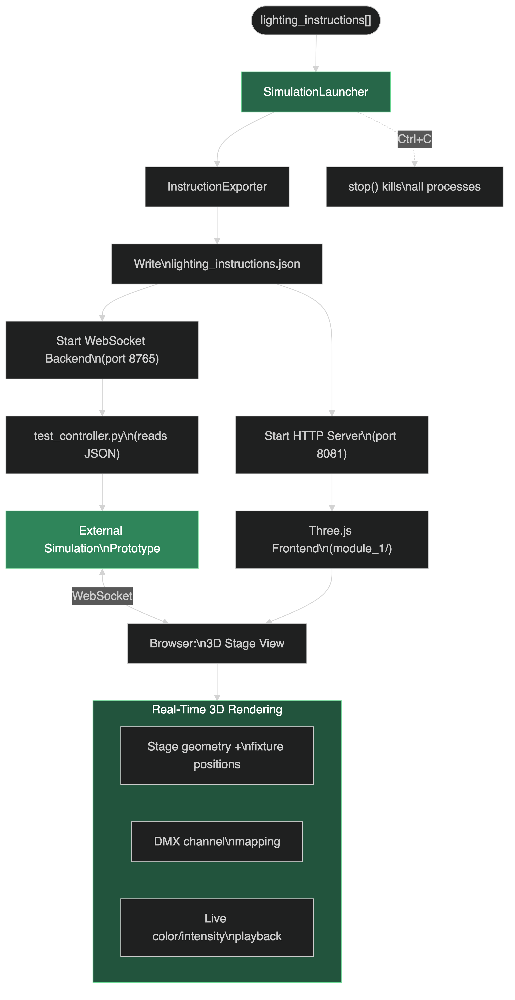

# Automated Auditorium Lighting — Architecture Flowcharts

> All diagrams rendered at 3x resolution from Mermaid source files in `docs/flowcharts/`

---

## 1. Master Pipeline

---

## 2. Phase 6 — Pipeline Orchestrator (Control Flow)

---

## 3. Phase 1 — Script Parsing & Scene Extraction (Detailed)

---

## 4. Phase 2 — Emotion Analysis

---

## 5. Phase 3 — RAG Knowledge Retrieval

---

## 6. Phase 4 — Lighting Decision Engine

---

## 7. Phase 5 — Simulation & Visualization

---

## 8. Phase 7 — Evaluation & Metrics v2

---

> **Source files:** All Mermaid `.mmd` source files are in `docs/flowcharts/` if you need to edit and re-render.
> **Re-render command:** `cd docs/flowcharts && for f in *.mmd; do npx -y @mermaid-js/mermaid-cli -i "$f" -o "${f%.mmd}.png" -c mermaid-config.json -s 3 --backgroundColor transparent; done`
