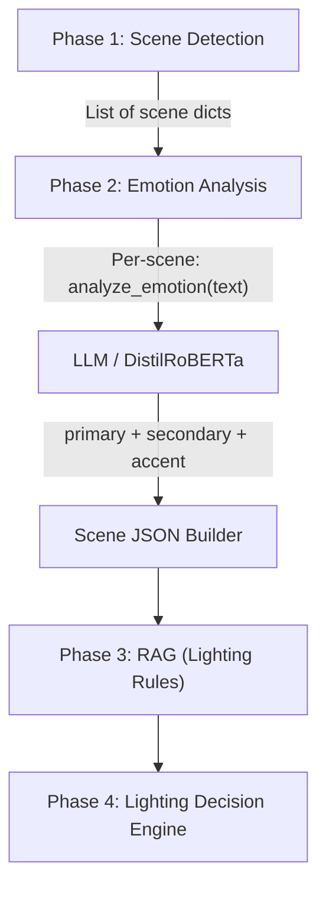

# Phase 2 Graph RAG Integration — Feasibility Analysis & Implementation Plan

---

## 1. Phase 2 Architecture Understanding

### Current Files

| File | Purpose |
|---|---|
| [emotion_analyzer.py](file:///c:/Users/HP/Downloads/Automated_Audiotorium_Lightning_Ram/Automated_Audiotorium_Lightning_Ram/phase_2/emotion_analyzer.py) | Core emotion classifier (Llama 3.1 8B + DistilRoBERTa fallback) |
| [__init__.py](file:///c:/Users/HP/Downloads/Automated_Audiotorium_Lightning_Ram/Automated_Audiotorium_Lightning_Ram/phase_2/__init__.py) | Backward-compat wrapper (string → dict adapter) |

### How EmotionAnalyzer Works (Line-by-Line)

```
EmotionAnalyzer.analyze(scene)        # Line 91
    ↓
    text = scene.get("text", "")      # Line 96 — extracts raw text only
    ↓
    _run_llm(text)                    # Line 106 — sends ONLY this scene's text to Llama 3.1
        ↓
        messages = [                  # Line 122–125
            system: "Analyze the provided scene text"
            user: text                # ← ONLY current scene, ZERO context
        ]
    ↓
    Returns: {"primary": "fear", "primary_confidence": 0.85, ...}
```

> **Critical observation**: The class docstring (line 47) explicitly says **"Stateless scene-local emotion classifier"**. Each scene is processed in complete isolation. No previous scene emotions, no character tracking, no emotional continuity.

### Where Scene → Emotion Processing Happens

| Consumer | File | Line | Call |
|---|---|---|---|
| [pipeline_runner.py](file:///c:/Users/HP/Downloads/Automated_Audiotorium_Lightning_Ram/Automated_Audiotorium_Lightning_Ram/backend/pipeline_runner.py) | [pipeline_runner.py](file:///c:/Users/HP/Downloads/Automated_Audiotorium_Lightning_Ram/Automated_Audiotorium_Lightning_Ram/backend/pipeline_runner.py) | 141 | [analyze_emotion(scene.get("content", ""))](file:///c:/Users/HP/Downloads/Automated_Audiotorium_Lightning_Ram/Automated_Audiotorium_Lightning_Ram/phase_2/emotion_analyzer.py#228-235) |
| [main.py](file:///c:/Users/HP/Downloads/Automated_Audiotorium_Lightning_Ram/Automated_Audiotorium_Lightning_Ram/main.py) | [main.py](file:///c:/Users/HP/Downloads/Automated_Audiotorium_Lightning_Ram/Automated_Audiotorium_Lightning_Ram/main.py) | 157 | [analyze_emotion(scene.get("content", ""))](file:///c:/Users/HP/Downloads/Automated_Audiotorium_Lightning_Ram/Automated_Audiotorium_Lightning_Ram/phase_2/emotion_analyzer.py#228-235) |

Both iterate scenes in a [for](file:///c:/Users/HP/Downloads/Automated_Audiotorium_Lightning_Ram/Automated_Audiotorium_Lightning_Ram/phase_1/__init__.py#235-257) loop and call [analyze_emotion](file:///c:/Users/HP/Downloads/Automated_Audiotorium_Lightning_Ram/Automated_Audiotorium_Lightning_Ram/phase_2/emotion_analyzer.py#228-235) independently per scene — no accumulation, no context passing.

---

## 2. Current Data Flow (No Graph RAG)



**What's missing in this flow:**
- Scene N has no knowledge of Scene N-1's emotion
- No character-emotion tracking across scenes
- No emotional arc awareness (e.g., "tension has been building for 3 scenes")
- Dialogue relationships are ignored

---

## 3. Graph RAG Feasibility Decision

### ✅ **Decision: Graph RAG IS BENEFICIAL**

### Reasons FOR Integration

| Reason | Technical Evidence |
|---|---|
| **Emotional Continuity** | Current [_run_llm()](file:///c:/Users/HP/Downloads/Automated_Audiotorium_Lightning_Ram/Automated_Audiotorium_Lightning_Ram/phase_2/emotion_analyzer.py#119-161) (line 122–125) sends ONLY the current scene text. A "reunion" scene after a "grief" scene should detect "bittersweet relief" — but without knowing the previous scene was "grief", the LLM detects "joy" instead. |
| **Character-Emotion Arcs** | If Character A expresses "anger" in Scene 2, then appears silent in Scene 4, the scene's overall emotion should factor in latent tension. Currently impossible — stateless processing. |
| **Scene Dependency** | A "calm before the storm" scene (Scene 5) followed by a "battle" scene (Scene 6) — the emotion of Scene 5 should be "tension/anticipation", not "serenity". Context from Scene 6's content helps retroactively. |
| **Accuracy Improvement** | Current accuracy is **0.53** average. Cross-scene context can improve this by correctly classifying emotionally ambiguous scenes. |
| **No Overlap with Phase 3** | Phase 3 RAG is for **lighting design rules** (FAISS index of fixture metadata). Graph RAG here is for **narrative/emotional relationships** — completely different domain. |

### Why This Is NOT Just "Adding Complexity"

The current system treats each scene as if it exists in a vacuum. In real scripts:
- Emotions cascade (grief → acceptance → hope)
- Characters carry emotional state across scenes
- A scene's emotional weight depends on what came before

---

## 4. Graph Schema Design

### Nodes

| Node Type | Properties | Source |
|---|---|---|
| `SceneNode` | `scene_id`, `text_preview` (first 200 chars), `position` (ordinal), [word_count](file:///C:/Users/HP/Downloads/Automated_Audiotorium_Lightning_Ram/Automated_Audiotorium_Lightning_Ram/phase_1/__init__.py#315-332) | Phase 1 output |
| `CharacterNode` | `name`, `first_appearance_scene` | Extracted from scene text via regex |
| `EmotionNode` | `label` (e.g., "fear"), [confidence](file:///c:/Users/HP/Downloads/Automated_Audiotorium_Lightning_Ram/Automated_Audiotorium_Lightning_Ram/Hitesh/phase_1/text_acquisition.py#256-283), [type](file:///c:/Users/HP/Downloads/Automated_Audiotorium_Lightning_Ram/Automated_Audiotorium_Lightning_Ram/Hitesh/phase_1/scene_json_builder.py#138-162) (primary/secondary/accent) | Phase 2 output |
| `DialogueNode` | `speaker`, `text_preview`, `scene_id` | Extracted from scene text via regex |

### Edges

| Edge | From → To | Meaning |
|---|---|---|
| `SCENE_FOLLOWS_SCENE` | SceneNode → SceneNode | Sequential scene ordering |
| `SCENE_HAS_CHARACTER` | SceneNode → CharacterNode | Character appears in scene |
| `CHARACTER_SPEAKS` | CharacterNode → DialogueNode | Character's dialogue |
| `SCENE_HAS_EMOTION` | SceneNode → EmotionNode | Detected emotion for scene |
| `CHARACTER_EXPRESSES` | CharacterNode → EmotionNode | Character's emotional state |
| `DIALOGUE_IN_SCENE` | DialogueNode → SceneNode | Dialogue belongs to scene |

---

## 5. New Pipeline Design

```
Phase 1: Scene Detection
        ↓
   Scene JSON List
        ↓
  ┌─────────────────┐
  │  Graph Builder   │  ← NEW: Builds scene/character/dialogue nodes
  │  (graph_rag/)    │
  └────────┬────────┘
           ↓
  ┌─────────────────┐
  │  Graph Storage   │  ← NEW: In-memory NetworkX graph
  └────────┬────────┘
           ↓
  ┌─────────────────┐
  │ Graph Retriever  │  ← NEW: Fetches context for current scene
  └────────┬────────┘
           ↓
  ┌─────────────────┐
  │ Emotion Analyzer │  ← MODIFIED: Now receives context-enriched prompt
  └────────┬────────┘
           ↓
  ┌─────────────────┐
  │ Graph Updater    │  ← NEW: Stores detected emotion back into graph
  └─────────────────┘
           ↓
     Phase 3 (unchanged)
```

---

## 6. Folder Structure

```
phase_2/
├── __init__.py                 # Entry point (MODIFIED — calls graph pipeline)
├── emotion_analyzer.py         # Core analyzer (MODIFIED — accepts context param)
└── graph_rag/
    ├── __init__.py
    ├── graph_builder.py        # [NEW] Builds graph from Phase 1 scenes
    ├── graph_schema.py         # [NEW] Node/Edge dataclass definitions
    ├── graph_storage.py        # [NEW] NetworkX graph wrapper
    ├── graph_retriever.py      # [NEW] Retrieves cross-scene context
    └── graph_utils.py          # [NEW] Character/dialogue extraction helpers
```

---

## 7. Data Flow Design

```
Scene JSON from Phase 1
    ↓
graph_builder.build_graph(scenes)
    → Creates SceneNodes for ALL scenes
    → Extracts CharacterNodes from each scene (regex: "CHARACTER_NAME:")
    → Creates DialogueNodes from dialogue lines
    → Links scenes sequentially (SCENE_FOLLOWS_SCENE)
    → Links characters to scenes (SCENE_HAS_CHARACTER)
    ↓
graph_storage.store(graph)
    → In-memory NetworkX DiGraph
    ↓
FOR each scene_i in scenes:
    context = graph_retriever.get_context(scene_i)
        → Previous scene's text preview
        → Characters present in this scene + their emotion history
        → Emotional arc summary (last 3 scenes)
    ↓
    emotion = emotion_analyzer.analyze(scene_i, context=context)
        → LLM prompt now includes: scene text + context
    ↓
    graph_storage.add_emotion(scene_i, emotion)
        → Stores EmotionNode, creates SCENE_HAS_EMOTION edge
```

---

## 8. Graph Technology Selection

### **Choice: NetworkX (in-memory Python graph)**

| Option | Verdict | Reason |
|---|---|---|
| **NetworkX** | ✅ Selected | Zero infrastructure, pure Python, perfect for small graphs (< 1000 nodes), pip-installable |
| Neo4j | ❌ Rejected | Requires separate server, Docker, auth setup — massive overkill for scripts with 5–30 scenes |
| FAISS + Graph | ❌ Rejected | FAISS is for vector similarity, not relationship traversal |
| LangChain GraphRAG | ❌ Rejected | Heavy dependency, designed for document-level RAG, not scene-level |
| Custom Graph | ❌ Rejected | NetworkX already provides a better custom graph than anything we'd write |

**Rationale**: A typical script has 5–30 scenes, 2–15 characters, 10–100 dialogue lines. Total graph size: **< 200 nodes, < 500 edges**. NetworkX handles this in microseconds with zero overhead.

---

## 9. Integration Points

### Modified Files

#### [phase_2/emotion_analyzer.py](file:///c:/Users/HP/Downloads/Automated_Audiotorium_Lightning_Ram/Automated_Audiotorium_Lightning_Ram/phase_2/emotion_analyzer.py)

| Function | Change |
|---|---|
| `EmotionAnalyzer.analyze()` | Add optional `context: str = None` parameter |
| `EmotionAnalyzer._run_llm()` | Inject context into the system prompt if provided |
| `SYSTEM_PROMPT` | Add context section: "You have the following context about surrounding scenes..." |

#### [phase_2/__init__.py](file:///c:/Users/HP/Downloads/Automated_Audiotorium_Lightning_Ram/Automated_Audiotorium_Lightning_Ram/phase_2/__init__.py)

| Function | Change |
|---|---|
| [analyze_emotion()](file:///c:/Users/HP/Downloads/Automated_Audiotorium_Lightning_Ram/Automated_Audiotorium_Lightning_Ram/phase_2/emotion_analyzer.py#228-235) | Add optional `context: str = None` parameter, pass through to core |

#### [backend/pipeline_runner.py](file:///c:/Users/HP/Downloads/Automated_Audiotorium_Lightning_Ram/Automated_Audiotorium_Lightning_Ram/backend/pipeline_runner.py)

| Location | Change |
|---|---|
| Line 127–155 | Replace simple per-scene loop with graph-aware loop: build graph → retrieve context → analyze → update graph |

#### [main.py](file:///c:/Users/HP/Downloads/Automated_Audiotorium_Lightning_Ram/Automated_Audiotorium_Lightning_Ram/main.py)

| Location | Change |
|---|---|
| Line 147–169 | Same graph-aware loop replacement |

### New Files (6 files in `phase_2/graph_rag/`)

All new. No existing files deleted.

---

## 10. Performance Analysis

| Metric | Estimate |
|---|---|
| **Graph construction time** | < 100ms for 30-scene script |
| **Per-scene context retrieval** | < 1ms (NetworkX neighbor traversal) |
| **Memory overhead** | < 5MB for largest scripts |
| **Total added latency per script** | ~200ms (graph build + N * retrieval) |
| **Graph node count** | 50–200 nodes (scenes + characters + dialogues) |
| **Graph edge count** | 100–500 edges |

**Conclusion**: Negligible overhead. The LLM API call (15s timeout) is 1000x slower than graph operations.

---

## 11. Accuracy Impact

### Expected Improvements

| Scenario | Without Graph RAG | With Graph RAG |
|---|---|---|
| "Calm before storm" scene | Detects "serenity" | Detects "tension" (knows next scene is battle) |
| Reunion after grief | Detects "joy" | Detects "bittersweet relief" (knows previous was grief) |
| Character silence after anger | Detects "neutral" | Detects "suppressed anger" (knows character history) |
| Building suspense (3+ scenes) | Each independently "mystery" | Detects "escalating dread" (knows arc) |

### Expected Accuracy Improvement

Current average: **0.53**. With contextual emotion analysis, estimated improvement: **+10–20%** for scripts with strong narrative arcs.

---

## 12. Risk Analysis

| Risk | Severity | Mitigation |
|---|---|---|
| Character extraction regex fails | Medium | Fallback: skip character nodes, still use scene-sequence context |
| Graph adds wrong edges | Low | Edges are deterministic (sequential scenes, regex matches) — not AI-generated |
| Memory usage on very long scripts | Low | Even 100 scenes = < 10MB graph |
| LLM ignores context in prompt | Medium | A/B test: compare with/without context, tune prompt |
| Breaks existing output format | High | Context is injected into prompt only — output JSON schema unchanged |
| Slows down pipeline | Low | Graph ops < 200ms total, LLM is the bottleneck |

---

## 13. Testing Plan

| Test Case | Input | Expected Validation |
|---|---|---|
| **Short script** (3 scenes) | Script-1.txt | Graph has 3 SceneNodes + edges, emotions detected |
| **Long script** (16+ scenes) | Script-8.txt | Graph builds correctly, retriever fetches context for each |
| **Single scene script** | Custom 1-scene | Graph has 1 node, no FOLLOWS edge, fallback to no-context |
| **Multi-character script** | Script-3.txt | CharacterNodes created, linked to scenes |
| **Emotion-heavy script** | Script with grief→joy→fear arc | Verify sequential context improves classification |
| **Fallback test** | Set `HF_API_TOKEN=""` | DistilRoBERTa fallback still works (context ignored by classifier) |
| **No regression** | All 24 scripts | [evaluate_all.py](file:///c:/Users/HP/Downloads/Automated_Audiotorium_Lightning_Ram/Automated_Audiotorium_Lightning_Ram/Evaluation_and_accuracy/evaluate_all.py) accuracy ≥ current 0.53 |

### Test Commands
```bash
# Single script test
python Evaluation_and_accuracy/evaluate_all.py --script Script-1.txt

# Full regression
python Evaluation_and_accuracy/evaluate_all.py

# Graph inspection (manual)
python -c "from phase_2.graph_rag import build_graph; ..."
```

---

## Summary

| Question | Answer |
|---|---|
| Is Graph RAG necessary? | Not strictly necessary, but clearly beneficial |
| Is Graph RAG beneficial? | **Yes** — adds emotional continuity, character tracking, arc awareness |
| Is Graph RAG possible? | **Yes** — NetworkX, zero infrastructure, ~200 lines of new code |
| Is Graph RAG suitable? | **Yes** — small graph (< 200 nodes), negligible overhead |
| Does it affect other phases? | **No** — Phase 3/4/5/6/7/8 untouched. Output format unchanged |
