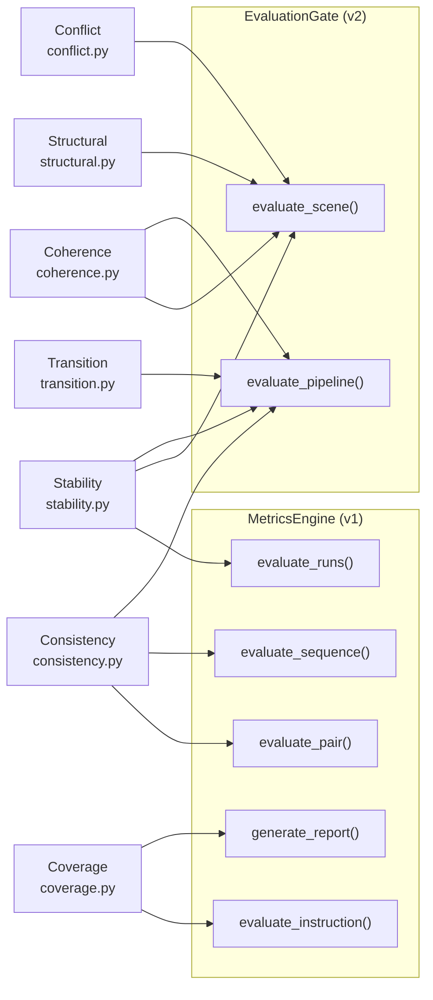
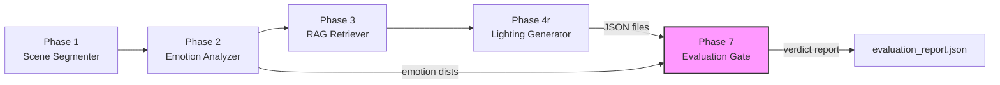
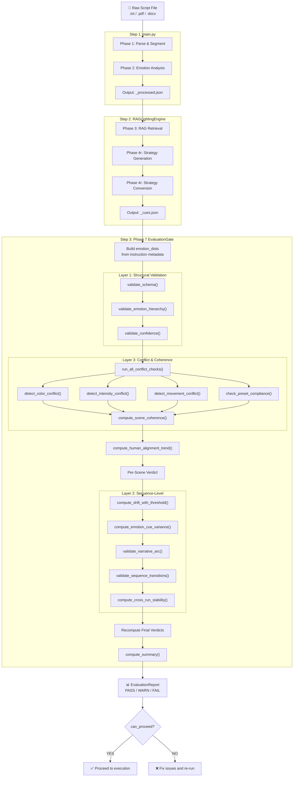
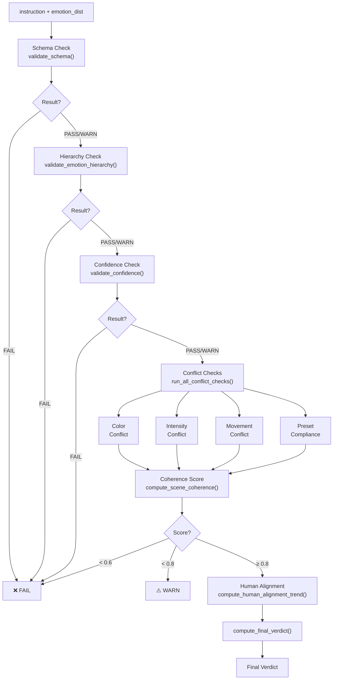
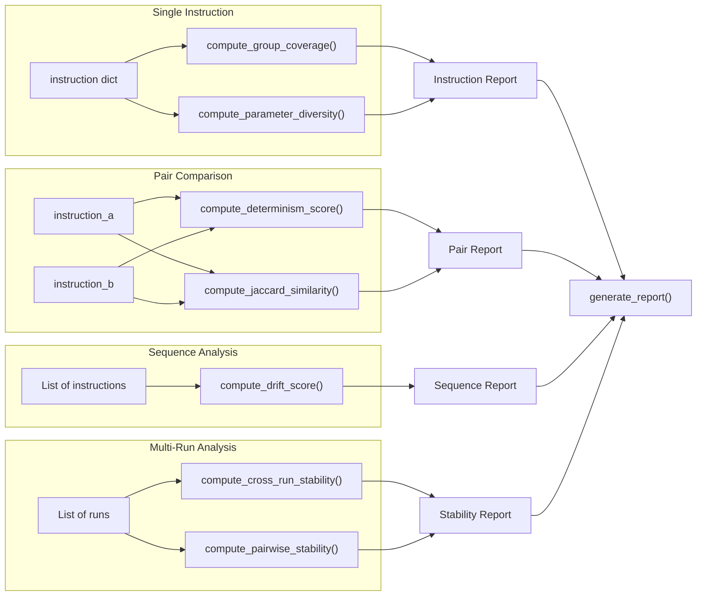
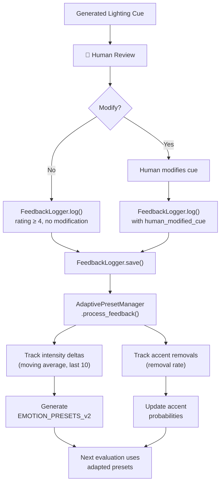
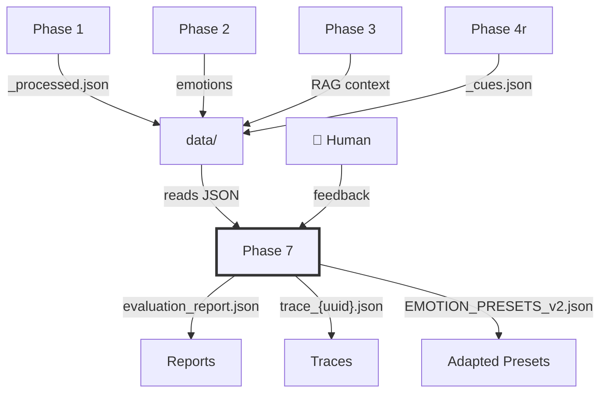

# Phase 7 — Complete Reference Document
### Evaluation & Metrics System | Automated Auditorium Lighting

> **Project:** Automated Auditorium Lighting  
> **Phase:** 7 — Evaluation & Metrics (v2)  
> **Last Updated:** 2026-02-21

---

## Table of Contents

1. [Complete Workflow & Integration of Phase 7](#1-complete-workflow--integration-of-phase-7)
2. [All Metrics — Definitions & Usage Locations](#2-all-metrics--definitions--usage-locations)
3. [Integration Guide — Where & How to Integrate Each Metric](#3-integration-guide--where--how-to-integrate-each-metric)
4. [Detailed Flowchart — Phase 7 Workflow & Metrics](#4-detailed-flowchart--phase-7-workflow--metrics)
5. [Replacement Strategy — Old Phase 7 → New Phase 7](#5-replacement-strategy--old-phase-7--new-phase-7)

---

## 1. Complete Workflow & Integration of Phase 7

### 1.1 Purpose

Phase 7 is the **post-generation evaluation layer**. It provides research-grade, observational-only metrics on the quality of lighting decisions produced by the upstream pipeline (Phases 1–4r). It exists for:

- Supporting the **research paper** with quantitative analysis
- Detecting **degenerate, conflicting, or inconsistent** lighting cues
- Tracking **human alignment** over iterative feedback cycles
- Running **ablation studies** (no_emotion, no_rag, single_group, temperature variants)

### 1.2 Critical Design Principle

> [!CAUTION]
> **Phase 7 is FULLY REMOVABLE.** Deleting the entire `phase_7/` directory must NOT affect any system execution or output. Phase 7 is a **passive observer** — it NEVER generates, modifies, or influences lighting data.

**Forbidden actions inside Phase 7:**
| Action | Reason |
|---|---|
| `from phase_4 import ...` | Phase isolation violation |
| Calling LLM APIs | Phase 4 responsibility |
| Querying RAG | Phase 3 responsibility |
| Modifying lighting intent | Passive observer rule |

### 1.3 End-to-End Pipeline Workflow

The full pipeline is orchestrated by `run_with_evaluation.py`:

| Step | Phase | Action | Output |
|------|-------|--------|--------|
| **Step 1** | Phases 1+2 (`main.py`) | Parse script → segment scenes → emotion analysis | `data/standardized_output/{name}_processed.json` |
| **Step 2** | Phases 3+4r (`RAGLightingEngine`) | RAG retrieval → strategy generation → lighting cues | `phase_7_testing_output/{name}_cues.json` |
| **Step 3** | Phase 7 (`EvaluationGate`) | 3-layer evaluation → verdict report | `phase_7_testing_output/{name}_evaluation.json` |

### 1.4 Phase 7 Internal Architecture

Phase 7 has **two subsystems** that work together:

#### A. Trace Logging Subsystem (v1)

| Component | File | Purpose |
|---|---|---|
| `TraceLogger` | `trace_logger.py` | Captures SHA-256 hashed execution traces |
| `TraceEntry` | `schemas.py` | Pydantic model for a single decision record |
| `TraceLog` | `schemas.py` | Collection of entries for one run |
| `RAGContextRef` | `schemas.py` | Opaque RAG ref (document_id, chunk_id only) |
| `MetricsEngine` | `metrics.py` | Orchestrates coverage, consistency, stability metrics |

#### B. Evaluation Gate Subsystem (v2)

| Component | File | Purpose |
|---|---|---|
| `EvaluationGate` | `evaluation_gate.py` | 3-layer evaluation orchestrator |
| `EvaluationVerdict` | `schemas_v2.py` | Per-scene PASS/WARN/FAIL across all checks |
| `EvaluationReport` | `schemas_v2.py` | Full pipeline report with summary counts |
| `MultiEmotionDistribution` | `schemas_v2.py` | Primary/secondary/accent emotion hierarchy |
| `FeedbackLogger` | `human_feedback.py` | Logs human corrections to JSON |
| `AdaptivePresetManager` | `human_feedback.py` | Generates versioned presets from feedback |
| `EMOTION_PRESETS_v1` | `presets_versioned.py` | Baseline reference presets (read-only copy) |
| Conflict rules | `presets_versioned.py` | Color classification + intensity/transition conflict rules |

### 1.5 The 3-Layer Evaluation

The `EvaluationGate` runs **3 sequential layers** for every pipeline output:

| Layer | Name | Scope | Sub-modules |
|-------|------|-------|-------------|
| **Layer 1** | Structural Validation | Per-scene | `structural.py` |
| **Layer 2** | Sequence-Level Metrics | Across scenes | `consistency.py`, `transition.py`, `coherence.py` (narrative arc) |
| **Layer 3** | Conflict & Coherence | Per-scene + cross-run | `conflict.py`, `coherence.py`, `stability.py` |

**Verdict resolution rules:**
- Any critical **FAIL** → scene is `FAIL`
- Coherence < 0.6 → `FAIL`
- Any **WARN** → `WARN`
- Coherence < 0.8 → `WARN`
- Otherwise → `PASS`

**Pipeline proceed logic:**
- `fail_count > 0` → `can_proceed = False`  
- `warn_count > 0` → `can_proceed = True` (warnings don't block)  
- All pass → `can_proceed = True`

### 1.6 File Structure

```
phase_7/
├── __init__.py              ← Package exports (v1 + v2)
├── schemas.py               ← Trace schemas (TraceEntry, TraceLog, RAGContextRef)
├── schemas_v2.py            ← Evaluation schemas (Verdict, EvaluationVerdict, etc.)
├── trace_logger.py          ← SHA-256 hashed trace capture
├── metrics.py               ← MetricsEngine (coverage + consistency + stability)
├── evaluation_gate.py       ← 3-layer evaluation orchestrator
├── human_feedback.py        ← FeedbackLogger + AdaptivePresetManager
├── presets_versioned.py     ← EMOTION_PRESETS_v1/v2 + conflict rules
├── demo.py                  ← Standalone demo script
├── evaluation/
│   ├── __init__.py          ← Sub-module exports
│   ├── coverage.py          ← Group coverage + parameter diversity
│   ├── consistency.py       ← Jaccard, determinism, drift, emotion-cue variance
│   ├── stability.py         ← Cross-run stability + human alignment trend
│   ├── structural.py        ← Schema + hierarchy + confidence validation
│   ├── conflict.py          ← Color, intensity, movement, preset compliance
│   ├── coherence.py         ← Coherence score + narrative arc validation
│   └── transition.py        ← Transition smoothness between scenes
└── experiment_configs/
    ├── baseline.yaml        ← Default evaluation settings
    └── ablation.yaml        ← Ablation study variants
```

---

## 2. All Metrics — Definitions & Usage Locations

### 2.1 Master Metric Table

Below is every metric in Phase 7, where it is **defined**, where it is **consumed**, and what it **measures**:

| # | Metric | Category | Defined In | Consumed By | What It Measures |
|---|--------|----------|------------|-------------|------------------|
| 1 | **Group Coverage** | Coverage | `evaluation/coverage.py` → `compute_group_coverage()` | `metrics.py` → `MetricsEngine.evaluate_instruction()` | Fraction of available fixture groups used (0.0–1.0) |
| 2 | **Parameter Diversity** | Coverage | `evaluation/coverage.py` → `compute_parameter_diversity()` | `metrics.py` → `MetricsEngine.evaluate_instruction()` | Variety of intensity range, transition types, colors, group count |
| 3 | **Jaccard Similarity** | Consistency | `evaluation/consistency.py` → `compute_jaccard_similarity()` | `metrics.py` → `MetricsEngine.evaluate_pair()` | Group ID overlap: J(A,B) = \|A∩B\| / \|A∪B\| |
| 4 | **Structural Determinism** | Consistency | `evaluation/consistency.py` → `compute_determinism_score()` | `metrics.py` → `MetricsEngine.evaluate_pair()`, `stability.py` | Structural matching (same groups, transitions, intensity ±ε) |
| 5 | **Drift Score** | Consistency | `evaluation/consistency.py` → `compute_drift_score()` | `metrics.py` → `MetricsEngine.evaluate_sequence()` | Average "distance" between consecutive instructions |
| 6 | **Drift with Threshold** | Consistency (v2) | `evaluation/consistency.py` → `compute_drift_with_threshold()` | `evaluation_gate.py` → `evaluate_pipeline()` | Drift score + PASS/WARN/FAIL verdict (thresholds: 0.4 / 0.7) |
| 7 | **Emotion-Cue Variance** | Consistency (v2) | `evaluation/consistency.py` → `compute_emotion_cue_variance()` | `evaluation_gate.py` → `evaluate_pipeline()` | Intensity variance per emotion group (threshold: 0.05) |
| 8 | **Cross-Run Stability** | Stability | `evaluation/stability.py` → `compute_cross_run_stability()` | `metrics.py` → `MetricsEngine.evaluate_runs()`, `evaluation_gate.py` | How consistent outputs are across multiple runs with same input |
| 9 | **Pairwise Stability** | Stability | `evaluation/stability.py` → `compute_pairwise_stability()` | Available via `evaluation/__init__.py` export | Average stability across all pairs of runs |
| 10 | **Human Alignment Trend** | Stability (v2) | `evaluation/stability.py` → `compute_human_alignment_trend()` | `evaluation_gate.py` → `evaluate_scene()` | % of scenes unchanged by human + improving/stable/declining trend |
| 11 | **Schema Validation** | Structural (v2) | `evaluation/structural.py` → `validate_schema()` | `evaluation_gate.py` → `evaluate_scene()` | Checks required fields, value ranges, transition enums |
| 12 | **Emotion Hierarchy Validation** | Structural (v2) | `evaluation/structural.py` → `validate_emotion_hierarchy()` | `evaluation_gate.py` → `evaluate_scene()` | Weight sum = 1.0, primary ≥ 0.6, accent ≤ 0.1, max 3 emotions |
| 13 | **Confidence Validation** | Structural (v2) | `evaluation/structural.py` → `validate_confidence()` | `evaluation_gate.py` → `evaluate_scene()` | Primary score ≥ 0.5, secondary ≥ 0.4, accent ≥ 0.3 |
| 14 | **Color Conflict Detection** | Conflict (v2) | `evaluation/conflict.py` → `detect_color_conflict()` | `evaluation_gate.py` → `evaluate_scene()` (via `run_all_conflict_checks`) | Warm+cold mix with high secondary weight, >2 dominant colors |
| 15 | **Intensity Conflict Detection** | Conflict (v2) | `evaluation/conflict.py` → `detect_intensity_conflict()` | `evaluation_gate.py` → `evaluate_scene()` (via `run_all_conflict_checks`) | Low-emotion → high-intensity or vice versa |
| 16 | **Movement Conflict Detection** | Conflict (v2) | `evaluation/conflict.py` → `detect_movement_conflict()` | `evaluation_gate.py` → `evaluate_scene()` (via `run_all_conflict_checks`) | Transition type must follow primary emotion, not secondary |
| 17 | **Preset Compliance** | Conflict (v2) | `evaluation/conflict.py` → `check_preset_compliance()` | `evaluation_gate.py` → `evaluate_scene()` (via `run_all_conflict_checks`) | Key light matches expected preset (intensity ±0.1, color, transition) |
| 18 | **Coherence Score** | Coherence (v2) | `evaluation/coherence.py` → `compute_coherence_score()` | `evaluation_gate.py` → `evaluate_scene()` (via `compute_scene_coherence`) | 1 − (conflicts / total_checks); <0.6 = FAIL, <0.8 = WARN |
| 19 | **Narrative Arc Validation** | Coherence (v2) | `evaluation/coherence.py` → `validate_narrative_arc()` | `evaluation_gate.py` → `evaluate_pipeline()` | Emotion flips (max 3), flat arcs, excessive accent usage (>50%) |
| 20 | **Transition Smoothness** | Transition (v2) | `evaluation/transition.py` → `validate_transition_smoothness()` | `evaluation_gate.py` → `evaluate_pipeline()` (via `validate_sequence_transitions`) | Fade max jump 0.5, crossfade max 0.6, no negative durations |

### 2.2 Constant Thresholds

| Constant | Value | File | Purpose |
|----------|-------|------|---------|
| `INTENSITY_EPSILON` | 0.05 | `consistency.py` | Tolerance for intensity comparison in determinism |
| `DRIFT_WARN_THRESHOLD` | 0.4 | `consistency.py` | Drift above this → WARN |
| `DRIFT_FAIL_THRESHOLD` | 0.7 | `consistency.py` | Drift above this → FAIL |
| `VARIANCE_WARN_THRESHOLD` | 0.05 | `consistency.py` | Max emotion-cue intensity variance |
| `PRIMARY_CONFIDENCE_MIN` | 0.5 | `structural.py` | Below this → FAIL |
| `SECONDARY_CONFIDENCE_MIN` | 0.4 | `structural.py` | Below this → WARN |
| `ACCENT_CONFIDENCE_MIN` | 0.3 | `structural.py` | Below this → WARN |
| `FADE_MAX_JUMP` | 0.5 | `transition.py` | Max intensity Δ for fade transitions |
| `CROSSFADE_MAX_JUMP` | 0.6 | `transition.py` | Max intensity Δ for crossfade transitions |
| `LOW_INTENSITY_MAX` | 0.5 | `presets_versioned.py` | Max intensity for low-emotion scenes |
| `HIGH_INTENSITY_MIN` | 0.6 | `presets_versioned.py` | Min intensity for high-emotion scenes |
| `MAX_SECONDARY_WEIGHT_FOR_TEMPERATURE_MIX` | 0.3 | `presets_versioned.py` | Max secondary weight for warm+cold blending |

### 2.3 Where Each Metric Category Is Used



---

## 3. Integration Guide — Where & How to Integrate Each Metric

### 3.1 Integration Architecture Overview

Phase 7 integrates at **one single entry point**: after the lighting cues have been generated by Phase 4r. It reads pre-generated JSON files and produces evaluation reports.



### 3.2 Per-Metric Integration Guide

#### Coverage Metrics

| Metric | Integrate In | How | Input Required |
|--------|-------------|-----|----------------|
| `compute_group_coverage()` | After Phase 4r generates cues | Pass instruction dict + set of available groups | `instruction["groups"]`, `{"FRONT_WASH", "BACK_LIGHT", "SIDE_FILL"}` |
| `compute_parameter_diversity()` | Same as above | Pass individual instruction dict | `instruction["groups"]` with parameters and transitions |

**Integration code:**
```python
from phase_7.evaluation.coverage import compute_group_coverage, compute_parameter_diversity

available = {"FRONT_WASH", "BACK_LIGHT", "SIDE_FILL", "SPOT_1", "SPOT_2"}
coverage = compute_group_coverage(instruction, available)
diversity = compute_parameter_diversity(instruction)
```

---

#### Consistency Metrics

| Metric | Integrate In | How | Input Required |
|--------|-------------|-----|----------------|
| `compute_jaccard_similarity()` | Compare two instructions | Pass two sets of group IDs | `set_a`, `set_b` extracted from instructions |
| `compute_determinism_score()` | Compare two instructions | Pass two instruction dicts + epsilon | Two instruction dicts |
| `compute_drift_score()` | After processing a scene sequence | Pass list of instruction dicts | `List[dict]` of instructions |
| `compute_drift_with_threshold()` | Inside `EvaluationGate.evaluate_pipeline()` | Auto-called for sequences ≥ 2 | `List[dict]` of instructions |
| `compute_emotion_cue_variance()` | Inside `EvaluationGate.evaluate_pipeline()` | Auto-called for sequences ≥ 2 | Instructions with `metadata.emotion` |

**Integration code:**
```python
from phase_7.evaluation.consistency import (
    compute_drift_with_threshold,
    compute_emotion_cue_variance,
)

verdict, drift_score, issues = compute_drift_with_threshold(instructions)
consistency_verdict, details = compute_emotion_cue_variance(instructions)
```

---

#### Stability Metrics

| Metric | Integrate In | How | Input Required |
|--------|-------------|-----|----------------|
| `compute_cross_run_stability()` | After multiple pipeline runs on same input | Pass list of runs (each run = list of instructions) | `List[List[dict]]` |
| `compute_pairwise_stability()` | Same as above (more thorough) | Pass same structure | `List[List[dict]]` |
| `compute_human_alignment_trend()` | Inside `EvaluationGate.evaluate_scene()` | Auto-called if feedback entries provided | `List[dict]` of HumanFeedbackEntry |

**Integration code:**
```python
from phase_7.evaluation.stability import compute_cross_run_stability

runs = [instructions_run1, instructions_run2, instructions_run3]
stability = compute_cross_run_stability(runs, epsilon=0.05)
```

---

#### Structural Validation

| Metric | Integrate In | How | Input Required |
|--------|-------------|-----|----------------|
| `validate_schema()` | Before any metric computation | Pass instruction dict | Single `LightingInstruction` dict |
| `validate_emotion_hierarchy()` | After emotion analysis | Pass emotion distribution dict | Dict with `primary_emotion`, weights, scores |
| `validate_confidence()` | After emotion analysis | Pass emotion distribution dict | Same as above |

**Integration code:**
```python
from phase_7.evaluation.structural import validate_schema, validate_emotion_hierarchy

schema_verdict, schema_issues = validate_schema(instruction)
hierarchy_verdict, hierarchy_issues = validate_emotion_hierarchy(emotion_dist)
```

---

#### Conflict Detection

| Metric | Integrate In | How | Input Required |
|--------|-------------|-----|----------------|
| `detect_color_conflict()` | After cue generation | Pass emotion_dist + instruction | Both dicts |
| `detect_intensity_conflict()` | After cue generation | Pass emotion_dist + instruction | Both dicts |
| `detect_movement_conflict()` | After cue generation | Pass emotion_dist + instruction | Both dicts |
| `check_preset_compliance()` | After cue generation | Pass emotion label + instruction | `str` + dict |
| `run_all_conflict_checks()` | **Recommended entry point** — runs all 4 above | Pass emotion_dist + instruction | Both dicts |

**Integration code:**
```python
from phase_7.evaluation.conflict import run_all_conflict_checks

result = run_all_conflict_checks(emotion_dist, instruction)
# result["overall"] → "PASS" / "WARN" / "FAIL"
# result["all_issues"] → List[str]
```

---

#### Coherence & Narrative

| Metric | Integrate In | How | Input Required |
|--------|-------------|-----|----------------|
| `compute_scene_coherence()` | After conflict checks (per-scene) | Pass emotion_dist, instruction, conflict_result | All three dicts |
| `validate_narrative_arc()` | After processing full sequence | Pass list of instructions with `metadata.emotion` | `List[dict]` |

---

#### Transition Smoothness

| Metric | Integrate In | How | Input Required |
|--------|-------------|-----|----------------|
| `validate_transition_smoothness()` | Between two consecutive scenes | Pass two instruction dicts | Two dicts |
| `validate_sequence_transitions()` | After full sequence generation | Pass list of instructions | `List[dict]` |

---

### 3.3 The Simplest Integration — Using EvaluationGate

If you want **all metrics at once**, use the `EvaluationGate` class. It internally calls every metric:

```python
from phase_7.evaluation_gate import EvaluationGate

gate = EvaluationGate(
    output_dir="phase_7_testing_output",   # saves JSON report
    feedback_entries=feedback_list,          # optional
)

report = gate.evaluate_pipeline(
    instructions=lighting_instructions,     # List[dict]
    emotion_dists=emotion_distributions,    # List[dict]
    runs=multi_run_data,                    # Optional List[List[dict]]
)

if report.can_proceed:
    print("✅ Approved")
else:
    print("❌ Rejected")

summary = gate.get_verdict_summary(report)
print(summary)
```

### 3.4 Human Feedback Integration

```python
from phase_7.human_feedback import FeedbackLogger, AdaptivePresetManager

# 1. Log feedback
logger = FeedbackLogger(log_dir="phase_7/data/feedback")
logger.log(
    scene_id="scene_001",
    emotion_distribution=emotion_dist,
    generated_cue=original_instruction,
    human_modified_cue=modified_instruction,  # or None if unchanged
    human_rating=4,                           # 1–5
)
logger.save()

# 2. Adapt presets over time
manager = AdaptivePresetManager()
manager.process_feedback(logger.entries)
adapted_presets = manager.get_preset(version=2)
manager.save_presets("phase_7/data/presets")
```

---

## 4. Detailed Flowchart — Phase 7 Workflow & Metrics

### 4.1 End-to-End Pipeline Flow



### 4.2 Per-Scene Evaluation Flow



### 4.3 Metrics Computation Flow (MetricsEngine v1)



### 4.4 Human Feedback Loop Flow



---

## 5. Replacement Strategy — Old Phase 7 → New Phase 7

If you are instructed to **replace the old Phase 7 with this newer version**, here is a complete guide on what to change and where.

### 5.1 Files to Replace / Add

| Action | File / Directory | Reason |
|--------|-----------------|--------|
| **REPLACE** | `phase_7/__init__.py` | Add v2 exports (`EvaluationGate`, `FeedbackLogger`, etc.) |
| **REPLACE** | `phase_7/evaluation/consistency.py` | Add v2 functions: `compute_drift_with_threshold()`, `compute_emotion_cue_variance()` |
| **REPLACE** | `phase_7/evaluation/stability.py` | Add v2 function: `compute_human_alignment_trend()` |
| **REPLACE** | `phase_7/evaluation/__init__.py` | Add v2 module exports (structural, conflict, coherence, transition) |
| **ADD** | `phase_7/schemas_v2.py` | New schemas: `Verdict`, `EvaluationVerdict`, `EvaluationReport`, `MultiEmotionDistribution`, `HumanFeedbackEntry` |
| **ADD** | `phase_7/evaluation_gate.py` | New 3-layer evaluation orchestrator |
| **ADD** | `phase_7/human_feedback.py` | New `FeedbackLogger` + `AdaptivePresetManager` |
| **ADD** | `phase_7/presets_versioned.py` | New presets reference + conflict rules |
| **ADD** | `phase_7/evaluation/structural.py` | New Layer 1 validation module |
| **ADD** | `phase_7/evaluation/conflict.py` | New Layer 3 conflict detection module |
| **ADD** | `phase_7/evaluation/coherence.py` | New Layer 3 coherence + narrative arc module |
| **ADD** | `phase_7/evaluation/transition.py` | New transition smoothness validation |
| **KEEP** | `phase_7/schemas.py` | No changes — v2 extends, not replaces |
| **KEEP** | `phase_7/trace_logger.py` | No changes |
| **KEEP** | `phase_7/metrics.py` | No changes |
| **KEEP** | `phase_7/evaluation/coverage.py` | No changes |
| **FIX** | `phase_7/experiment_configs/baseline.yaml` | Remove git merge conflict markers |
| **FIX** | `phase_7/experiment_configs/ablation.yaml` | Remove git merge conflict markers |

### 5.2 External Integration Points (Outside Phase 7)

These files **outside** `phase_7/` need changes to integrate the new version:

#### A. `run_with_evaluation.py` (Root)
- **Status:** Already integrated ✅
- **What it does:** Orchestrates the full pipeline + Phase 7 gate
- **Integration pattern:**
  1. Builds `emotion_dists` from instruction metadata
  2. Creates `EvaluationGate` with output directory
  3. Calls `gate.evaluate_pipeline(instructions, emotion_dists)`
  4. Prints verdict summary and saves report JSON

#### B. `app.py` (API Server)
- **Status:** Needs integration 🔧
- **What to add:**
  - Import `EvaluationGate`
  - Add an `/api/evaluate` endpoint that accepts lighting cues JSON
  - Return evaluation report as JSON response
  - Add `/api/feedback` endpoint to accept human feedback

```python
# Suggested addition to app.py
from phase_7.evaluation_gate import EvaluationGate
from phase_7.human_feedback import FeedbackLogger

@app.post("/api/evaluate")
async def evaluate_cues(payload: dict):
    gate = EvaluationGate()
    report = gate.evaluate_pipeline(
        payload["instructions"],
        payload["emotion_dists"]
    )
    return report.model_dump()
```

#### C. Frontend Dashboard
- **Status:** Needs implementation 🔧
- **What to show:**
  - Per-scene verdict table (PASS/WARN/FAIL for each check)
  - Overall pipeline verdict with can_proceed status
  - Coherence score gauge (0.0–1.0)
  - Drift score visualization
  - Human alignment trend graph

#### D. `main.py` (Pipeline Orchestrator)
- **Status:** No changes needed ✅
- Phase 7 is passive — `main.py` generates data, Phase 7 reads it afterward
- The connection is through `run_with_evaluation.py` which calls `main.py` first

### 5.3 Integration Checklist

```
[ ] Replace phase_7/__init__.py with v2 exports
[ ] Add phase_7/schemas_v2.py
[ ] Add phase_7/evaluation_gate.py
[ ] Add phase_7/human_feedback.py
[ ] Add phase_7/presets_versioned.py
[ ] Add phase_7/evaluation/structural.py
[ ] Add phase_7/evaluation/conflict.py
[ ] Add phase_7/evaluation/coherence.py
[ ] Add phase_7/evaluation/transition.py
[ ] Update phase_7/evaluation/__init__.py with v2 exports
[ ] Update phase_7/evaluation/consistency.py with v2 additions
[ ] Update phase_7/evaluation/stability.py with v2 additions
[ ] Fix merge conflicts in experiment_configs/baseline.yaml
[ ] Fix merge conflicts in experiment_configs/ablation.yaml
[ ] Verify run_with_evaluation.py works end-to-end
[ ] Add API endpoints in app.py (/api/evaluate, /api/feedback)
[ ] Update frontend to display evaluation verdicts
```

### 5.4 What NOT to Change

> [!IMPORTANT]
> These files and directories must remain **completely untouched** during Phase 7 integration:

| Do Not Touch | Reason |
|---|---|
| `phase_1/` | Scene segmentation — no Phase 7 dependency |
| `phase_2/` | Emotion analysis — no Phase 7 dependency |
| `phase_3/`, `phase_3r/` | RAG retrieval — no Phase 7 dependency |
| `phase_4/`, `phase_4r/` | Lighting generation — Phase 7 reads output, never modifies |
| `phase_5/` | Visualization — independent |
| `phase_6/` | DMX output — independent |
| `phase_8/` | Advanced features — independent |
| `contracts/` | Shared contracts — Phase 7 has its own internal schemas |
| `data/lighting_cues/` | Generated cue files — Phase 7 reads only |
| `data/standardized_output/` | Processed scene files — Phase 7 reads only |

### 5.5 Dependency Map

> [!NOTE]
> Phase 7 has **zero upstream dependencies** on other phases. All dependencies flow **into** Phase 7 as data.



---

> **End of Document**  
> For questions, see the [Phase 7 README](../phase_7/README.md) or run `python phase_7/demo.py` for a quick demonstration.
